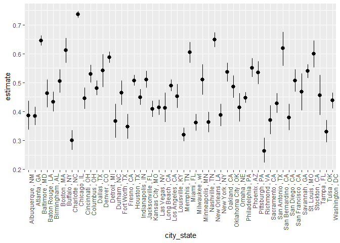
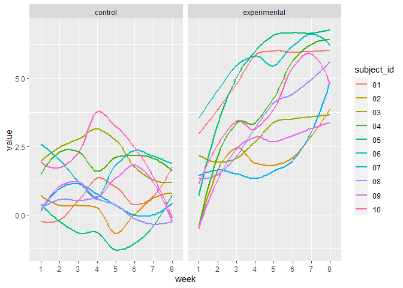

p8105_hw5_rl3328
================
Ruixi Li
2023-11-03

``` r
library(tidyverse)
library(readr)
library(purrr)
library(plotly)
library(forcats)
```

# Problem 1

## import, clean and describe data

- I created the variable `city_state`.

``` r
homicide = read_csv("data/Problem1/homicide-data.csv") |>
  janitor::clean_names() |>
  dplyr::mutate(
    city_state = paste(city,",",state),
    city_state = str_replace(city_state,"Tulsa , AL", "Tulsa , OK")) #correct the misclassification of state for Tulsa
```

the raw data have 52179 records and13 variables. Column names are uid,
reported_date, victim_last, victim_first, victim_race, victim_age,
victim_sex, city, state, lat, lon, disposition, city_state that include
the victim name, race, age, and sex; the date the homicide was reported;
and the location of the homicide. In cleaning, I created a `city_state`
variable that includes both city and state, and a `resolution` variable
to indicate whether the case was closed by arrest. I also corrected one
entry that has a misclassification of state from “Tulsa, AL” to “Tulsa,
OK”.

## summerize and get the proportion

- I summarized within cities to obtain the total number of homicides and
  the number of unsolved homicides (those for which the disposition is
  “Closed without arrest” or “Open/No arrest”).

- For the city of Baltimore, MD, use the prop.test function to estimate
  the proportion of homicides that are unsolved; save the output of
  prop.test as an R object, apply the broom::tidy to this object and
  pull the estimated proportion and confidence intervals from the
  resulting tidy dataframe.

``` r
p = homicide |>
  group_by(city_state) |># there's no missing in city or state variables
  summarise(total_count = n(),
            unsolved_count = sum(disposition %in% c("Closed without arrest","Open/No arrest"))) |>
  filter(city_state == "Baltimore , MD") 

prop.test(pull(p,unsolved_count), pull(p,total_count),conf.level = .95) |>
  broom::tidy() |>
  select(estimate,conf.low, conf.high)
```

    ## # A tibble: 1 × 3
    ##   estimate conf.low conf.high
    ##      <dbl>    <dbl>     <dbl>
    ## 1    0.646    0.628     0.663

## get the proportions for all locations

Now run prop.test for each of the cities in your dataset, and extract
both the proportion of unsolved homicides and the confidence interval
for each. Do this within a “tidy” pipeline, making use of purrr::map,
purrr::map2, list columns and unnest as necessary to create a tidy
dataframe with estimated proportions and CIs for each city.

I had a function calculating prop and its 95%CI.

``` r
prop = function(df){
  
  pp = prop.test(pull(df,unsolved_count), pull(df,total_count),conf.level = .95) |>
    broom::tidy() |>
    select(estimate,conf.low, conf.high)
}

prop(p)#check if the function works

data_city = homicide |>
  group_by(city_state) |># there's no missing in city or state variables
  summarise(total_count = n(),
            unsolved_count = sum(disposition %in% c("Closed without arrest","Open/No arrest"))) 

result =
  data_city |>
  group_by(city_state) |>
  nest() |>
  mutate(proportion_test = map(data, prop)) |>
  select(city_state, proportion_test) |>
  unnest(proportion_test) |>
  mutate(city_state = as.factor(city_state),
         city_state = fct_reorder(city_state,desc(estimate)))
```

## visualization

Create a plot that shows the estimates and CIs for each city – check out
geom_errorbar for a way to add error bars based on the upper and lower
limits. Organize cities according to the proportion of unsolved
homicides.

``` r
result |>
  mutate(city_state = fct_reorder(city_state, desc(estimate))) |>
  ggplot(aes(x = city_state, y = estimate)) +
  geom_pointrange(aes(ymin = conf.low, ymax = conf.high)) + 
  theme(axis.text.x = element_text(angle = 90, hjust = 1))
```

<!-- -->

# Problem 2

## import and clean data

``` r
longitudinal = function(path,filename) {
  
  df = 
    read_csv(path) |>
    janitor::clean_names() |>
    mutate(id = filename) |>
    pivot_longer(
      cols = -id,
      names_to = "week",
      values_to = "value",
      names_prefix = "week_") |>
    separate(id,c("arm","subject_id"),sep="_") |>
    mutate(
      arm = recode(
        arm,
        con = "control",
        exp = "experimental"),
      subject_id = gsub("\\.csv$","",subject_id))

  df
  
}

filelst = list.files("./data/Problem2",full.names = TRUE)

q3_tidy = 
  purrr::map(filelst, ~ longitudinal(.x,basename(.x))) |> 
  bind_rows()

#some checks
q3_tidy |>
  group_by(week) |> 
  summarise(n = n())
```

    ## # A tibble: 8 × 2
    ##   week      n
    ##   <chr> <int>
    ## 1 1        20
    ## 2 2        20
    ## 3 3        20
    ## 4 4        20
    ## 5 5        20
    ## 6 6        20
    ## 7 7        20
    ## 8 8        20

``` r
q3_tidy |>
  group_by(subject_id) |> 
  summarise(n = n())   
```

    ## # A tibble: 10 × 2
    ##    subject_id     n
    ##    <chr>      <int>
    ##  1 01            16
    ##  2 02            16
    ##  3 03            16
    ##  4 04            16
    ##  5 05            16
    ##  6 06            16
    ##  7 07            16
    ##  8 08            16
    ##  9 09            16
    ## 10 10            16

``` r
q3_tidy |>
  group_by(week, subject_id) |> 
  summarise(n = n())
```

    ## # A tibble: 80 × 3
    ## # Groups:   week [8]
    ##    week  subject_id     n
    ##    <chr> <chr>      <int>
    ##  1 1     01             2
    ##  2 1     02             2
    ##  3 1     03             2
    ##  4 1     04             2
    ##  5 1     05             2
    ##  6 1     06             2
    ##  7 1     07             2
    ##  8 1     08             2
    ##  9 1     09             2
    ## 10 1     10             2
    ## # ℹ 70 more rows

## make a spaghetti plot

Make a spaghetti plot showing observations on each subject over time,
and comment on differences between groups

``` r
q3_tidy |>
  ggplot(aes(x = week, y = value, color = subject_id)) +
  geom_smooth(aes(group = subject_id),se = FALSE)+
  facet_grid(.~arm)
```

    ## `geom_smooth()` using method = 'loess' and formula = 'y ~ x'

<!-- -->

Participants in control arm didn’t show significant change in value over
the 8 weeks of study, whereas participants in experimental arm saw a
considerable increase in value over the 8 weeks.

# Problem 3

## mu = 0

``` r
set.seed(1)

p3 = function(mu,n = 30,sigma = 5){#mu must be in the first place?

  sim_data = tibble(
     x = rnorm(n, mean = mu, sd = sigma),
  )
    sim_data |>
    t.test(mu = 0, paired = FALSE, var.equal = FALSE, conf.level = 0.95) |> 
    broom::tidy() |>
    select(estimate, p.value) |>
    janitor::clean_names()
}

results_df =   
  map(1:5000, \(i) p3(mu = 0)) |> bind_rows()
```

## mu =0:6

``` r
sim_results_df = 
  expand_grid(
    mu = 0:6,
    iter = 1:5000) |> 
  mutate(
    estimate_df = map(mu,p3)) |> 
  unnest(estimate_df)
```

## visualization

Make a plot showing the proportion of times the null was rejected (the
power of the test) on the y axis and the true value of μ on the x axis.
Describe the association between effect size and power.

``` r
plot_df = sim_results_df |>
  mutate(
    conclusion = ifelse(p_value < 0.05, "reject","not reject")) |>
  group_by(mu) |>
  summarise(total_count = n(),
            reject = sum(conclusion == "reject")) |>
  mutate(prop = reject/total_count) 

power = plot_df |>
  plot_ly(x = ~mu, y = ~prop, type = 'scatter', mode = "line") |>
  layout(title = 'Association between effect size and power', plot_bgcolor = "#e5ecf6",
         xaxis = list(title = "Effect Size",
                     tickvals = seq(0, 6, by = 1),
                     ticktext = seq(0, 6, by = 1)),
         yaxis = list(title = "Power")) 
power
```

<div class="plotly html-widget html-fill-item-overflow-hidden html-fill-item" id="htmlwidget-b7fe7f8ff00a74bae3b9" style="width:672px;height:480px;"></div>
<script type="application/json" data-for="htmlwidget-b7fe7f8ff00a74bae3b9">{"x":{"visdat":{"61e46ca0933":["function () ","plotlyVisDat"]},"cur_data":"61e46ca0933","attrs":{"61e46ca0933":{"x":{},"y":{},"mode":"line","alpha_stroke":1,"sizes":[10,100],"spans":[1,20],"type":"scatter"}},"layout":{"margin":{"b":40,"l":60,"t":25,"r":10},"title":"Association between effect size and power","plot_bgcolor":"#e5ecf6","xaxis":{"domain":[0,1],"automargin":true,"title":"Effect Size","tickvals":[0,1,2,3,4,5,6],"ticktext":[0,1,2,3,4,5,6]},"yaxis":{"domain":[0,1],"automargin":true,"title":"Power"},"hovermode":"closest","showlegend":false},"source":"A","config":{"modeBarButtonsToAdd":["hoverclosest","hovercompare"],"showSendToCloud":false},"data":[{"x":[0,1,2,3,4,5,6],"y":[0.049599999999999998,0.1812,0.55740000000000001,0.89439999999999997,0.98699999999999999,0.99980000000000002,1],"mode":"line","type":"scatter","marker":{"color":"rgba(31,119,180,1)","line":{"color":"rgba(31,119,180,1)"}},"error_y":{"color":"rgba(31,119,180,1)"},"error_x":{"color":"rgba(31,119,180,1)"},"line":{"color":"rgba(31,119,180,1)"},"xaxis":"x","yaxis":"y","frame":null}],"highlight":{"on":"plotly_click","persistent":false,"dynamic":false,"selectize":false,"opacityDim":0.20000000000000001,"selected":{"opacity":1},"debounce":0},"shinyEvents":["plotly_hover","plotly_click","plotly_selected","plotly_relayout","plotly_brushed","plotly_brushing","plotly_clickannotation","plotly_doubleclick","plotly_deselect","plotly_afterplot","plotly_sunburstclick"],"base_url":"https://plot.ly"},"evals":[],"jsHooks":[]}</script>

- For true μ=0, the value on y-axis represents the probability of false
  positive(Type I error); For true μ=1:6,the value on y-axis represents
  power, the power increases as the effect size increases. For a study
  with a sample size of 30, an effect size=3 can bring the power up to
  more than 80%, an effect size=6 has been larger enough to bring the
  power of t test up to 1.

Make a plot showing the average estimate of μ^ on the y axis and the
true value of μ on the x axis.

``` r
estimate_all = sim_results_df |>
  group_by(mu) |>
  summarise(avg_estimate = mean(estimate)) |>
  plot_ly(x = ~mu, y = ~avg_estimate, type = 'scatter', mode = 'line', name = 'all') |>
  layout(title = 'Association between true mu and its estimate', plot_bgcolor = "#e5ecf6",
         xaxis = list(title = "True mu",
                     tickvals = seq(0, 6, by = 1),
                     ticktext = seq(0, 6, by = 1)),
         yaxis = list(title = "Estimate")) 
estimate_all
```

<div class="plotly html-widget html-fill-item-overflow-hidden html-fill-item" id="htmlwidget-23b76e5ddb11fee520c5" style="width:672px;height:480px;"></div>
<script type="application/json" data-for="htmlwidget-23b76e5ddb11fee520c5">{"x":{"visdat":{"61e41c26741":["function () ","plotlyVisDat"]},"cur_data":"61e41c26741","attrs":{"61e41c26741":{"x":{},"y":{},"mode":"line","name":"all","alpha_stroke":1,"sizes":[10,100],"spans":[1,20],"type":"scatter"}},"layout":{"margin":{"b":40,"l":60,"t":25,"r":10},"title":"Association between true mu and its estimate","plot_bgcolor":"#e5ecf6","xaxis":{"domain":[0,1],"automargin":true,"title":"True mu","tickvals":[0,1,2,3,4,5,6],"ticktext":[0,1,2,3,4,5,6]},"yaxis":{"domain":[0,1],"automargin":true,"title":"Estimate"},"hovermode":"closest","showlegend":false},"source":"A","config":{"modeBarButtonsToAdd":["hoverclosest","hovercompare"],"showSendToCloud":false},"data":[{"x":[0,1,2,3,4,5,6],"y":[-0.0039504983280903546,1.0036531015387007,1.9898295645394246,2.9932014076568247,4.0069890977673479,5.0177066258984455,6.005648130318419],"mode":"line","name":"all","type":"scatter","marker":{"color":"rgba(31,119,180,1)","line":{"color":"rgba(31,119,180,1)"}},"error_y":{"color":"rgba(31,119,180,1)"},"error_x":{"color":"rgba(31,119,180,1)"},"line":{"color":"rgba(31,119,180,1)"},"xaxis":"x","yaxis":"y","frame":null}],"highlight":{"on":"plotly_click","persistent":false,"dynamic":false,"selectize":false,"opacityDim":0.20000000000000001,"selected":{"opacity":1},"debounce":0},"shinyEvents":["plotly_hover","plotly_click","plotly_selected","plotly_relayout","plotly_brushed","plotly_brushing","plotly_clickannotation","plotly_doubleclick","plotly_deselect","plotly_afterplot","plotly_sunburstclick"],"base_url":"https://plot.ly"},"evals":[],"jsHooks":[]}</script>

- For a large sample size(n=5000),the average estimate of μ^ can
  accurately represent the true value.

Make a second plot (or overlay on the first) the average estimate of μ^
only in samples for which the null was rejected on the y axis and the
true value of μ on the x axis. Is the sample average of μ^ across tests
for which the null is rejected approximately equal to the true value of
μ? Why or why not?

``` r
estimate_rej = sim_results_df |>
  filter(p_value<0.05) |>
  group_by(mu) |>
  summarise(avg_estimate = mean(estimate))
 

compare = add_trace(estimate_all, x = ~pull(estimate_rej,mu), y = ~pull(estimate_rej,avg_estimate), type = 'scatter',mode = 'line', name = "reject") |>layout(legend=list(title=list(text='Data Range')))

compare
```

<div class="plotly html-widget html-fill-item-overflow-hidden html-fill-item" id="htmlwidget-97bb64e4e469a57d7780" style="width:672px;height:480px;"></div>
<script type="application/json" data-for="htmlwidget-97bb64e4e469a57d7780">{"x":{"visdat":{"61e41c26741":["function () ","plotlyVisDat"]},"cur_data":"61e41c26741","attrs":{"61e41c26741":{"x":{},"y":{},"mode":"line","name":"all","alpha_stroke":1,"sizes":[10,100],"spans":[1,20],"type":"scatter"},"61e41c26741.1":{"x":{},"y":{},"mode":"line","name":"reject","alpha_stroke":1,"sizes":[10,100],"spans":[1,20],"type":"scatter","inherit":true}},"layout":{"margin":{"b":40,"l":60,"t":25,"r":10},"title":"Association between true mu and its estimate","plot_bgcolor":"#e5ecf6","xaxis":{"domain":[0,1],"automargin":true,"title":"True mu","tickvals":[0,1,2,3,4,5,6],"ticktext":[0,1,2,3,4,5,6]},"yaxis":{"domain":[0,1],"automargin":true,"title":"Estimate"},"legend":{"title":{"text":"Data Range"}},"hovermode":"closest","showlegend":true},"source":"A","config":{"modeBarButtonsToAdd":["hoverclosest","hovercompare"],"showSendToCloud":false},"data":[{"x":[0,1,2,3,4,5,6],"y":[-0.0039504983280903546,1.0036531015387007,1.9898295645394246,2.9932014076568247,4.0069890977673479,5.0177066258984455,6.005648130318419],"mode":"line","name":"all","type":"scatter","marker":{"color":"rgba(31,119,180,1)","line":{"color":"rgba(31,119,180,1)"}},"error_y":{"color":"rgba(31,119,180,1)"},"error_x":{"color":"rgba(31,119,180,1)"},"line":{"color":"rgba(31,119,180,1)"},"xaxis":"x","yaxis":"y","frame":null},{"x":[0,1,2,3,4,5,6],"y":[-0.10036631045150493,2.2063117067081586,2.6210242838776816,3.1657252202405664,4.0369964139077865,5.0183079025629747,6.005648130318419],"mode":"line","name":"reject","type":"scatter","marker":{"color":"rgba(255,127,14,1)","line":{"color":"rgba(255,127,14,1)"}},"error_y":{"color":"rgba(255,127,14,1)"},"error_x":{"color":"rgba(255,127,14,1)"},"line":{"color":"rgba(255,127,14,1)"},"xaxis":"x","yaxis":"y","frame":null}],"highlight":{"on":"plotly_click","persistent":false,"dynamic":false,"selectize":false,"opacityDim":0.20000000000000001,"selected":{"opacity":1},"debounce":0},"shinyEvents":["plotly_hover","plotly_click","plotly_selected","plotly_relayout","plotly_brushed","plotly_brushing","plotly_clickannotation","plotly_doubleclick","plotly_deselect","plotly_afterplot","plotly_sunburstclick"],"base_url":"https://plot.ly"},"evals":[],"jsHooks":[]}</script>

- For true mu=0, the sample average of μ^ across tests for which the
  null(μ=0) is rejected is produced by false positive data(not of our
  focus);

- For true μ=1:6, the estimated μ^ solely based on the significant
  result may appear larger than it actually is, especially if the effect
  size is small. As the effect size increases,the sample average of μ^
  becomes more close to the true value of μ.If researchers only focus on
  statistically significant results, smaller effect sizes may still be
  statistically significant, given a sufficiently large sample size.

- Reasons: In the presence of sampling variability, extreme values (far
  from the null hypothesis) are more likely to produce statistically
  significant results. When effect size is small,the number of tests for
  which the null(μ=0) is rejected is relatively small, the sample
  average of μ^ is more likely to be subject to the upward bias.
  However, as effect size increases, power increases, the number of
  tests for which the null(μ=0) is rejected increases, higher power
  increases the chances of detecting a true effect.
